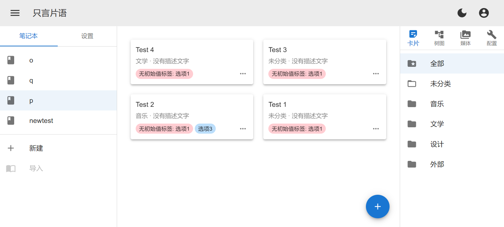
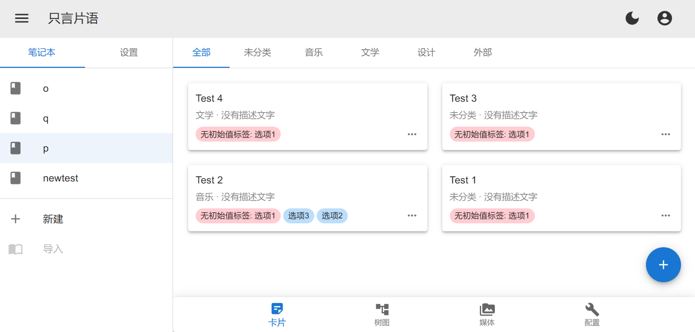
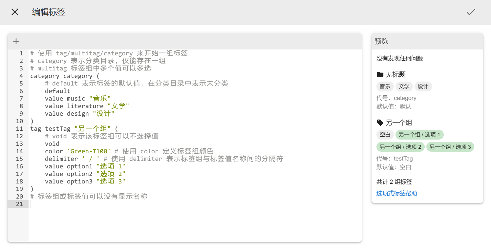
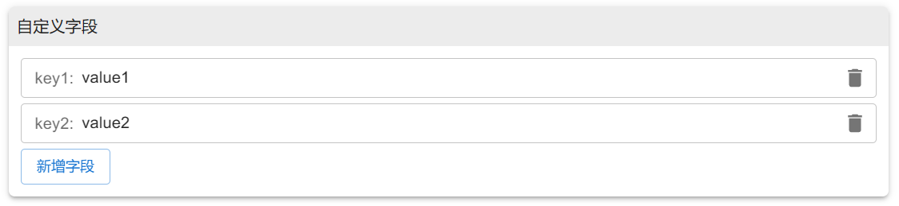
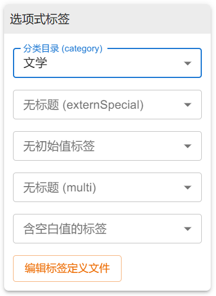

<mdc-composition>

# Sparks Documentation

Ver. appendix/22w52 for app Indev 0.1.0 简体中文

<mdc-alert warning>

这篇文档对应的是初步测试版本，功能尚不完善。因此，这篇文档也可能不完全符合将来正式版软件的使用方法。请慎重对待。

</mdc-alert>

**只言片语 (sparks)** 是一个用来记录和管理个人灵感的 Web 端单页面应用程序。其旨在允许用户随时随地、方便安全地记录自己突然涌现的灵感，并在以后回顾、汇总。

## 如何处理你的数据？

### 数据存储方式

你最关心的，应当是应用如何对待你宝贵的数据。为了保护隐私，数据默认采用本地存储的方式，但受浏览器条件所限，事实上，我们采用了一种看起来非常“不谨慎”的方式——存储在浏览器本地数据中。如果你使用符合规范的浏览器，这应当是可靠且安全的。

<mdc-alert danger>

不要好奇清除浏览器上的网站数据会发生什么。我们已经帮你试过了——你将会永久失去你在本地存储的内容，真的很久！

</mdc-alert>

具体而言，我们使用基于 `IndexedDB` 的存储方案。在一般浏览器中，这一存储方案的存储限度为磁盘总容量的一半。

<mdc-alert info>

要转移或备份你的数据，你可以使用导入、导出的方式。你还可以选择登录并开启跨设备的数据同步。遗憾的是，这些功能现在还没有实现。如你所见，这是一个初步测试版本，目前还不适合生产环境下的使用。

</mdc-alert>

### 逻辑结构

接下来的问题是，数据是通过什么样的层次结构组织起来的。

#### 笔记本 (Notebook)

笔记本是存放所有灵感内容、媒体文件的载体。你可以在一个设备上创建多个笔记本。逻辑上讲，笔记本是一个“多实例层”，因此，不同笔记本之间**不能**以任何方式进行内容的共享和引用。

#### 卡片 (Spark)

卡片像是日记中的一篇文章，是存放单个灵感内容的载体。一个笔记本可以存放多个卡片。

#### 媒体 (Media)

媒体用于存放照片、音频、视频等不适合直接编码成文本写进卡片的二进制内容。一个卡片可以引用同一个笔记本内的媒体。

#### 配置数据 (Config)

除卡片和媒体外，笔记本还会存储配置数据，这包括笔记本中的一些功能设置，以及分类标签的定义。

### 别名 (Alias)

如果你尝试过在界面上点击一些“新建”按钮，你将会被要求输入“别名”。别名是笔记本/卡片的唯一标识符，就像你在别处见到的编号或 UUID 那样。但是，别名并不是顺序生成或随机生成的，而是由你来决定。这样，你可以对数据同步的行为进行更好的掌控。

## 了解界面

<mdc-imgborder>

</mdc-imgborder>

这是一张普通界面的普通截图。

- 左侧为导航菜单，你可以选择或新建笔记本，也可以打开全局设置页面。
- 类手机设备上，标题栏会显示当前正在查看的笔记本或设置页面的名称，而不是“只言片语”。
- 左上角按钮可以切换导航菜单的显示与隐藏。在类手机设备上，此菜单会默认收起，按左上角按钮才会显示。
- 右上角按钮可以随时切换亮色与暗色模式。
- 右侧为笔记本查看选项卡，只会在笔记本查看页面显示。若设备宽度较小，选项卡会显示在屏幕底部。

<mdc-imgborder>

</mdc-imgborder>

## 笔记本管理

笔记本新建、删除和重命名的操作应当是非常显然的（其中删除和重命名在“配置”页面中均可以找到），此文档中不浪费篇幅进行演示。

### 标签编辑

在笔记本的“配置”页面中，选择“选项式标签”项下方的按钮，即可编辑标签。

<mdc-imgborder>

</mdc-imgborder>

这是默认配置文件的内容。右侧预览框会显示代码中存在的问题以及所有标签的预览。移动端上，屏幕底部默认会显示快捷符号栏，以方便触摸屏上符号的输入。

可以看到标签组具有 `category` `tag` `multitag` 三类，每个组可以包含若干标签值。对于 `multitag` 标签组，一个卡片可以选择多个值，或不选择；对于另外两类，一个卡片只能选择一个值。`category` 表示分类目录，只能出现一组。

#### 格式

标签组的格式形如 `category|tag|multitag <代号> ["<标题文字>"] ( ... )`，其中小括号内有若干行，可以是：

- 属性 `delimiter "<分隔符>"`，表示标签组标题文字和标签值标题文字之间使用的分隔符，默认是 `: `。
- 属性 `color "<颜色>"`，表示标签组的颜色，写法见下文。
- 标签值 `void`，不能存在于 `multitag` 中。若选中该值，则不显示此标签。
- 标签值 `default`，不能存在于 `multitag` 中。若选中该值，则仅显示标签组的标题文字。
- 标签值 `value|initValue|externValue <代号> ["<标题文字>"]`。其中，`initValue` 和 `externValue` 分别表示默认值和外源值（后文解释），它们在 `multitag` 中均无效。

#### 颜色写法

颜色写法需要分别定义用于亮色模式和暗色模式的标签颜色，均用十六进制表示，例如 `#EAEAEA/#333333`。

系统内置了一些颜色名称，也可以使用。它们形如 `Red-T100` `Green-T400` `Blue-A100` 等。具体颜色列表遵循 [Material Design 色卡](https://m2.material.io/design/color/)。一般而言，为了保证界面的协调统一性，建议使用 `T100` 颜色。

<mdc-alert warning>

对于有多个单词的颜色名称，应采用大驼峰拼写，例如 `DeepPurple-T100`。

灰色应当写作 `Grey`，不是 `Gray`。

</mdc-alert>

## 卡片管理

卡片的新建、复制与删除操作仍然是显然的，不予赘述。

### 编辑

#### 编辑内容

无论设备类型，打开卡片后，均会默认显示预览界面。切换到编辑界面（桌面端点击“分屏”或“编辑”图标，移动端点击“编辑”选项卡）方可编辑内容。

内容是使用 Markdown 书写的。

<mdc-alert info>

目前 Markdown 编辑器不完善。后续将会支持键盘快捷键等操作。

</mdc-alert>

#### 自定义字段

自定义字段允许创建若干自定义的键值对。目前这个功能并没有什么用，只是为后续可能需要的功能而保留。

#### 选项式标签

使用此模块可以给卡片分配标签。如果你发现需要一组新的标签，你可以点击下方按钮编辑标签定义文件。

#### 版本关系

你可以选择一个已经存在的卡片作为这个卡片的“上一个版本”。你还可以选择一个或多个卡片作为其“灵感来源”。

如果 `category` 标签组内定义了 `externValue`，你可以在添加灵感来源时添加不存在的别名。

</mdc-composition>
